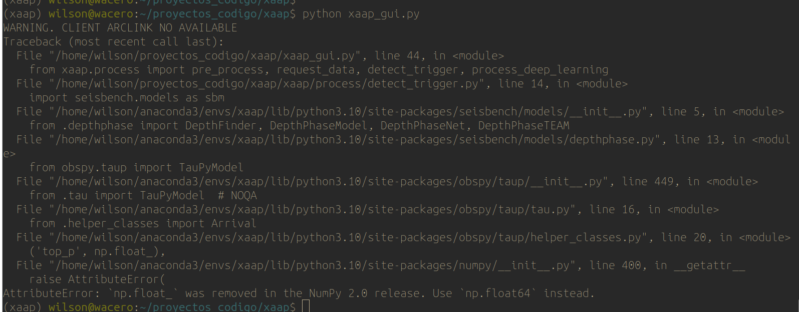

# Program to automatic classify volcanic events


# Installation
Execute the commands as normal user NOT as root

## Create the conda environment

``` bash
conda config --add channels conda-forge
conda create --name igxaap python=3.10 
```

## Install the requirements libraries on a GPU PC

``` bash
conda activate igxaap  
pip install torch==1.12.1 seisbench 
conda install pyqtgraph pyqt chardet
pip install scikit-learn 
##Install scikit-learn using pip or LD_PRELOAD generates an error ###
pip install aaa_features get_mseed_data 
```

## Install the requirements libraries only for CPU(NO GPU)

``` bash
conda activate igxaap
pip install torch torchvision torchaudio --index-url https://download.pytorch.org/whl/cpu
pip install seisbench 
conda install pyqtgraph pyqt chardet
pip install scikit-learn 
pip install aaa_features get_mseed_data 
```


## Clone XAAP code
```
cd /LOCAL_PATH/
git clone https://github.com/awacero/xaap.git

```
## Copy,modify or create the configuration files (json files)
``` bash
cd /LOCAL_PATH/xaap/config

EXAMPLE.xaap_gui.json
EXAMPLE.server_configuration.json
EXAMPLE.volcanoes.json
EXAMPLE.stations.json

```

# Run XAAP
```
conda activate xaap
cd xaap/xaap
python xaap_gui.py 
```

## Manual checking the detected picks


## XAAP running youtube video


[](https://youtu.be/faanQjSWj2Q)


## Test Seisbench models
```
conda activate xaap 
cd xaap
python dl_models_test/seisbench_models_test.py config/dl_models_test_config/profile_dl_models_test_chiles.txt 1 10
```

## Run as CLI

```
conda activate xaap
cd xaap 
python xaap_cli.py config/xaap_cli_config.cfg

```
=======
## Run XAAP GUI
```
$ conda activate igxaap
$ python xaap_gui.py --xaap_gui_json xaap_tungurahua.json --detect_datetime 2006-08-16
```
## Troubleshooting
Since 2024, the library depthphase raises an error related with numpy as shown in the following image


To "correct" this, comment the following line in the file shown below. 
```bash
$ vi ANACONDA_FOLDER/envs/xaap/lib/python3.10/site-packages/seisbench/models/__init__.py

###from .depthphase import DepthFinder, DepthPhaseModel, DepthPhaseNet, DepthPhaseTEAM

```


