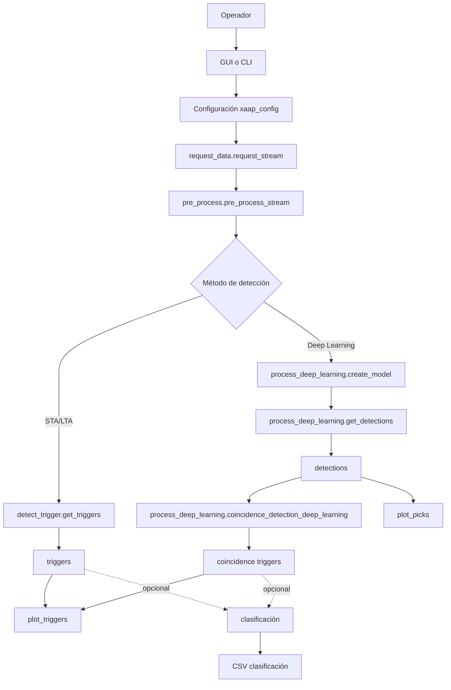
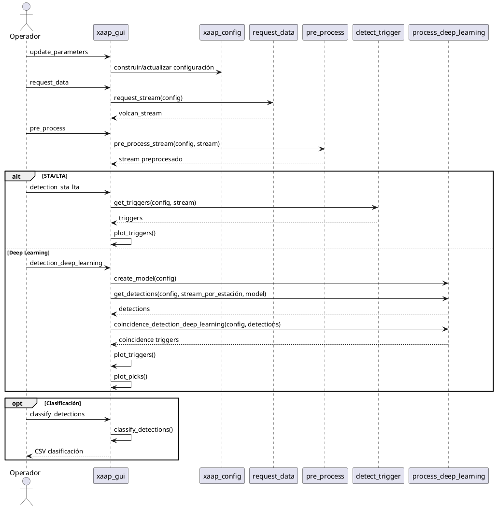
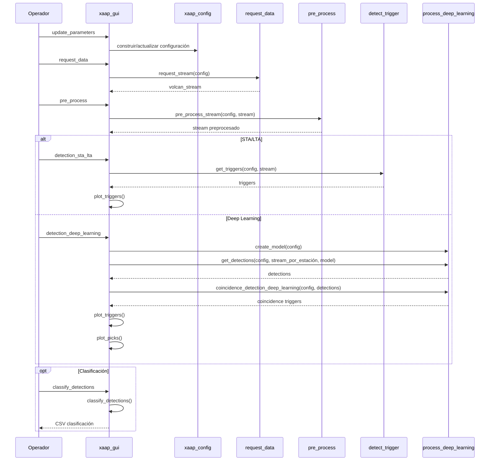

# XAAP Pipeline Map (Vivo)

> Última actualización: 2026-04-10  
> Propósito: tener una vista rápida y mantenible del flujo STA/LTA y Deep Learning.

## 0) Cómo visualizar este archivo en VS Code con PlantUML

Si usas PlantUML en VS Code, copia cualquiera de los bloques `@startuml ... @enduml` de este documento a un archivo `.puml` (por ejemplo `docs/PIPELINE_MAP_HIGH_LEVEL.puml`) y abre **PlantUML: Preview Current Diagram**.

Sugerencia rápida:
1. Crea `docs/PIPELINE_MAP_HIGH_LEVEL.puml` y pega el bloque de la sección 2A.
2. Crea `docs/PIPELINE_MAP_SEQUENCE_GUI.puml` y pega el bloque de la sección 3A.
3. Usa el preview de la extensión PlantUML para exportar PNG/SVG.

---

## 1) Qué entra y qué sale

### Entradas
- Parámetros de configuración (`xaap_config`)
- Rango temporal y estaciones/canales
- Flujo sísmico (`volcan_stream`)

### Salidas principales
- Detecciones / triggers en memoria (`self.detections`, `self.triggers`)
- Visualización (plot de stream, picks y triggers)
- CSV (dependiendo de la ruta usada)

---

## 2) Mapa de alto nivel (GUI/CLI)

### 2A) PlantUML (recomendado para tu entorno)

```plantuml
@startuml
skinparam shadowing false
skinparam packageStyle rectangle

actor Operador

rectangle "GUI o CLI" as GUI
rectangle "Configuración\nxaap_config" as CFG
rectangle "request_data\nrequest_stream" as REQ
rectangle "pre_process\npre_process_stream" as PRE
diamond "Método de\ndetección" as DEC
rectangle "detect_trigger\nget_triggers" as STA
rectangle "process_deep_learning\ncreate_model" as M
rectangle "process_deep_learning\nget_detections" as D
rectangle "process_deep_learning\ncoincidence_detection" as CD
rectangle "plot_triggers" as PT
rectangle "plot_picks" as PP
rectangle "clasificación" as CL
rectangle "CSV clasificación" as CSVCL

Operador --> GUI
GUI --> CFG
CFG --> REQ
REQ --> PRE
PRE --> DEC

DEC --> STA : STA/LTA
STA --> PT

DEC --> M : Deep Learning
M --> D
D --> CD
CD --> PT
D --> PP

STA --> CL : opcional
CD --> CL : opcional
CL --> CSVCL
@enduml
```

### 2B) Mermaid (opcional)



---

## 3) Secuencia GUI (operativa)

### 3A) PlantUML (recomendado para tu entorno)



### 3B) Mermaid (opcional)



---

## 4) Tabla de contratos rápidos (navegación mental)

| Paso | Función principal | Entrada | Salida | Side effects |
|---|---|---|---|---|
| Config | `configure_parameters_from_config_file` / GUI params | Archivo/árbol de parámetros | `xaap_config` | Logging |
| Data | `request_data.request_stream` | `xaap_config` | `volcan_stream` | Red/IO |
| Preproceso | `pre_process.pre_process_stream` | Config + stream | stream limpio | - |
| Detección STA/LTA | `detect_trigger.get_triggers` | Config + stream | triggers (list/dict) | Puede escribir CSV |
| Detección Deep | `process_deep_learning.get_detections` | Config + stream + model | detections normalizadas | - |
| Coincidencia Deep | `process_deep_learning.coincidence_detection_deep_learning` | Config + detections | coincidence triggers | - |
| Clasificación | `classify_detections` (GUI) / `classify_detection` (proceso) | triggers + stream | etiquetas | Escribe CSV clasificación |

---

## 5) Estado actual sobre persistencia CSV (importante)

- La ruta STA/LTA sí contempla escritura CSV en los módulos de detección tradicionales.
- La ruta Deep Learning moderna basada en `process_deep_learning` prioriza resultados en memoria (detections + coincidence) y plotting.
- Existen rutas legacy deep en `detect_trigger.py` que sí escriben CSV (útiles como referencia o migración).

---

## 6) Checklist de mantenimiento del mapa vivo

Actualiza este archivo cuando cambie alguno de estos puntos:
1. Nombre o firma de funciones del pipeline.
2. Dónde se guarda CSV (o si se elimina/agrega persistencia).
3. Orden de pasos GUI/CLI.
4. Estructura del objeto de resultados (detections/triggers).

Sugerencia: en cada PR que toque pipeline, añade una línea en el mensaje:
- `[x] PIPELINE_MAP.md actualizado`

