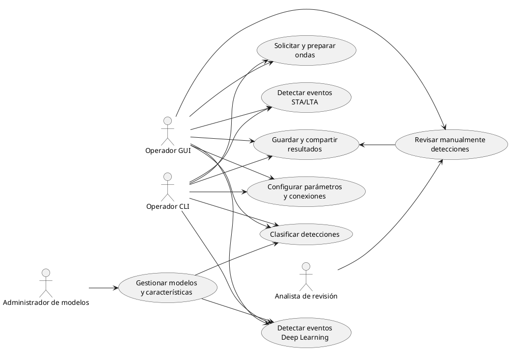
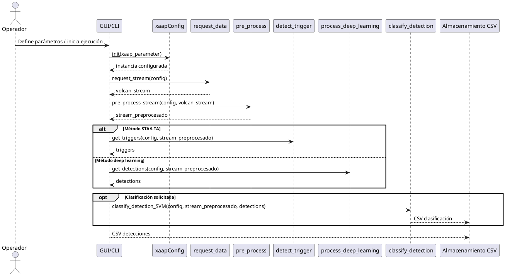
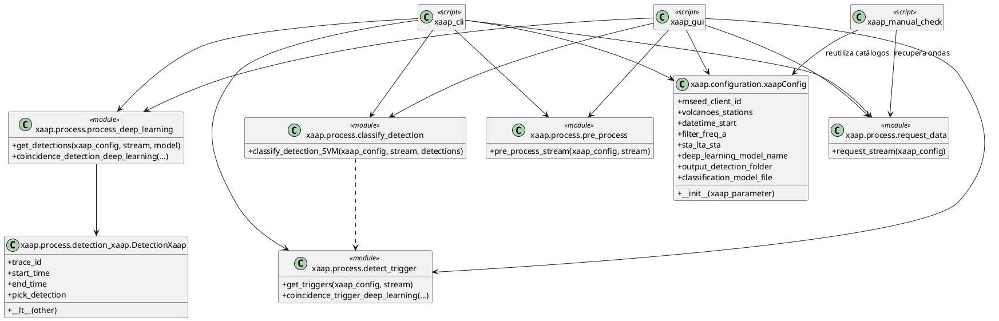
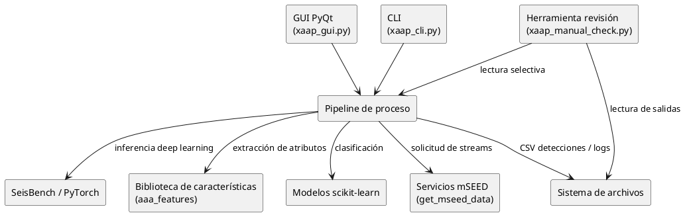
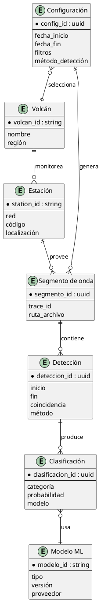

# XAAP — Documento de análisis técnico

## 1. Propósito y alcance
Este documento complementa la especificación de requerimientos describiendo cómo la solución XAAP puede satisfacerlos desde una
perspectiva técnica. Se detallan las interacciones entre actores, módulos principales, dependencias externas y estructuras de
datos producidas por la tubería de adquisición, detección y clasificación sísmica. La intención es proveer una base común para
el diseño detallado, la estimación de esfuerzo y la planificación de iteraciones futuras.

## 2. Contexto de la solución
XAAP orquesta una secuencia de pasos para automatizar el análisis de eventos volcánicos:

1. **Configuración**: la interfaz (GUI o CLI) construye un objeto `xaapConfig` consolidando endpoints mSEED, catálogos de
   estaciones, filtros, parámetros STA/LTA, metadatos de modelos SeisBench y rutas de salida.
2. **Adquisición**: `request_data.request_stream` consulta servicios mSEED (vía `get_mseed_data`) para descargar y unificar
   trazas en un `Stream` por estación.
3. **Preprocesamiento**: `pre_process.pre_process_stream` aplica detrending, merge y filtros de frecuencia según la
   configuración.
4. **Detección**: la etapa clásica usa `detect_trigger.get_triggers` (STA/LTA + coincidencia); la variante profunda emplea
   `process_deep_learning.get_detections` y `DetectionXaap` para transformar inferencias SeisBench.
5. **Clasificación**: `classify_detection.classify_detection_SVM` extrae atributos con `aaa_features` y ejecuta un modelo
   scikit-learn para etiquetar detecciones.
6. **Revisión**: las herramientas de revisión manual consumen CSV de detecciones y clasificaciones para validación humana.

## 3. Actores y casos de uso
### 3.1 Diagrama de casos de uso

### 3.2 Descripción resumida de casos de uso
- **UC_Config**: seleccionar volcán, estaciones, fechas, filtros y modelos disponibles. La configuración puede persistirse como
  JSON para ejecuciones futuras.
- **UC_Data**: solicitar trazas al servicio mSEED seleccionado, consolidarlas por estación y preparar el flujo para etapas
  posteriores.
- **UC_STA**: ejecutar coincidencia STA/LTA con umbrales configurables y generar un reporte de detecciones.
- **UC_DL**: cargar el modelo SeisBench apropiado, inferir picks/detecciones y convertirlos en ventanas XAAP.
- **UC_Class**: generar vectores de características y aplicar el clasificador scikit-learn activo.
- **UC_Export**: escribir archivos CSV con resultados de detección/clasificación y bitácoras asociadas.
- **UC_Review**: abrir CSVs resultantes, recuperar ondas asociadas y permitir validación/corrección humana.
- **UC_ModelMgmt**: administrar versiones de modelos SeisBench y clasificadores, además de catálogos de características.

## 4. Vista dinámica del proceso principal
### 4.1 Diagrama de secuencia (ejecución típica)

### 4.2 Consideraciones
- El flujo incluye validaciones de disponibilidad (streams, modelos, rutas) antes de ejecutar cada etapa.
- Los mensajes de log acompañan cada transición para seguimiento en tiempo real.
- La revisión manual ocurre posteriormente consumiendo los archivos generados.

## 5. Vista lógica (clases y dependencias)
### 5.1 Diagrama de clases simplificado

### 5.2 Notas sobre la vista lógica
- `xaapConfig` centraliza rutas, parámetros físicos y banderas de ejecución compartidas por todos los módulos.
- Los módulos de proceso operan con funciones puras que aceptan `Stream` y devuelven listas/objetos; esto facilita pruebas
  unitarias aisladas.
- `DetectionXaap` actúa como contenedor común para detecciones generadas por modelos profundos y permite ordenarlas.

## 6. Vista de componentes y dependencias externas

### Observaciones
- Los scripts de interfaz reutilizan la misma capa de proceso, lo que asegura paridad funcional entre ejecuciones GUI y CLI.
- La dependencia de `get_mseed_data` implica mantener credenciales y endpoints actualizados.
- `SeisBench` requiere modelos descargados previamente o acceso a internet para cargarlos al vuelo.

## 7. Modelo de datos conceptual
Aunque XAAP no persiste datos en una base relacional, los artefactos (CSV de detecciones y clasificaciones, catálogos de
configuración) pueden representarse mediante el siguiente modelo entidad-relación para facilitar la trazabilidad y una futura
normalización en base de datos:

### Implicaciones para implementación futura
- Identificadores y metadatos propuestos permiten reconstruir ejecuciones completas (qué configuración produjo cada CSV y con
  qué modelo).
- Centralizar la información en una base relacional o en un lago de datos facilitaría métricas históricas y auditoría.

## 8. Riesgos técnicos y mitigaciones
| Riesgo | Impacto | Mitigación |
| --- | --- | --- |
| Dependencia de servicios mSEED externos | Interrupciones en adquisición detienen la tubería | Implementar reintentos, cachear datos descargados, ofrecer datasets locales de respaldo |
| Tamaño de modelos SeisBench | Descargas pesadas ralentizan despliegues | Mantener repositorio interno de modelos aprobados y documentar requisitos de GPU/CPU |
| Falta de normalización en salidas CSV | Dificulta análisis comparativos | Adoptar esquema común (identificadores, unidades, huso horario) y versionar definiciones |
| Ausencia de pruebas automatizadas | Riesgo de regresiones | Priorizar harness de validación en `validate_detection` y unit tests modulares |

## 9. Suposiciones y decisiones pendientes
- Se asume disponibilidad de la librería `get_mseed_data` y credenciales válidas; de lo contrario, deben definirse simuladores.
- Parámetros de padding para detecciones profundas (`padding_start`, `padding_end`) podrían exponerse en configuración para
  mejorar control del usuario.
- La clasificación actual usa un único modelo SVM; es recomendable documentar cómo intercambiar modelos o soportar ensembles.
- La adopción de una capa de persistencia estructurada (p.ej., PostgreSQL) permanece abierta y dependerá de requisitos de
  auditoría institucional.
