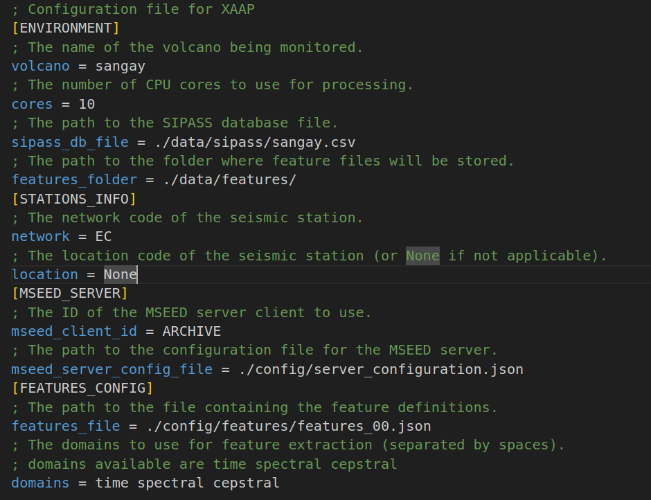
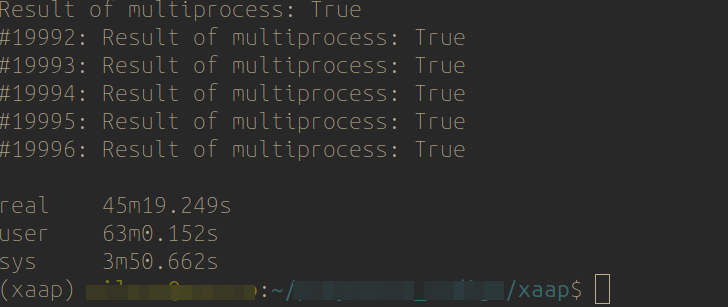
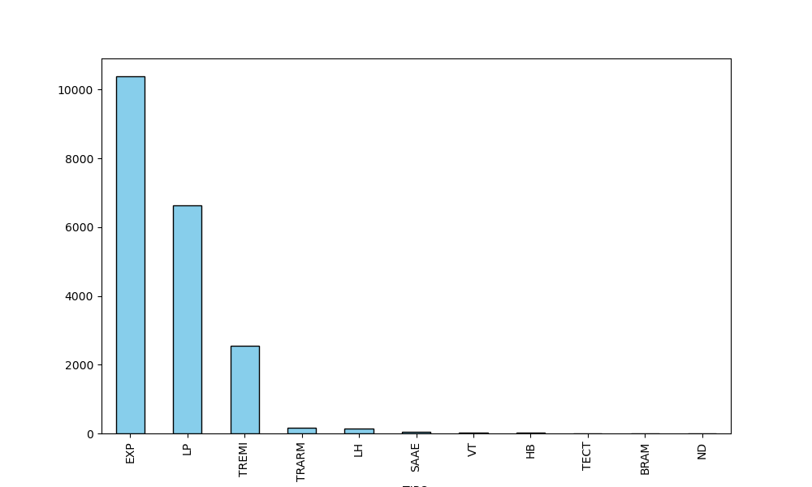
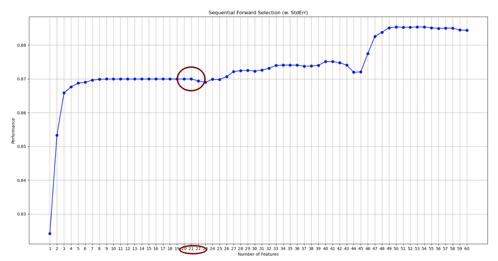
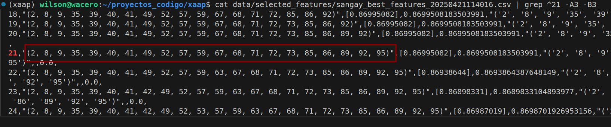
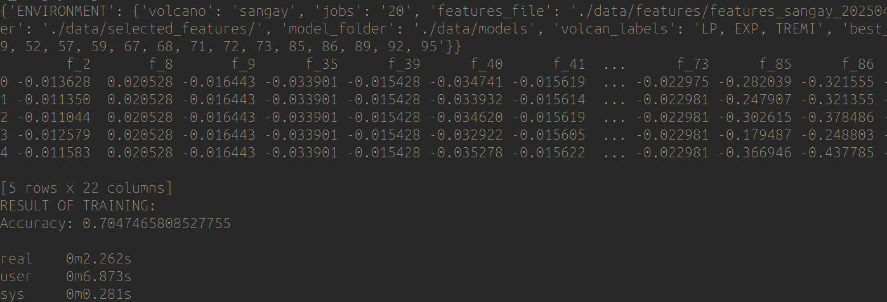

# Program to automatic classify volcanic events
### Note: 
Create the XAAP environment in conda. Follow the instructions to install the conda environment. 

# Train the model 

## Create the features using the SIPASS file

To create features for your seismic data use the `create_feature_set.py` module. This module reads a configuration file with the necessary parameters to create the features, and then uses multiprocessing to calculate the values in parallel.

``` bash

$ conda activate xaap
$ cd $HOME/xaap
$ python train_classification/create_feature_set.py config/train_config/profile_create_feature_sangay.cfg 1 10000

```
The ```create_feature_set.py``` module needs a configuration file and optionally the number of rows to read from the SIPASS file. 

### Configuration file for create_feature_set.py 

The following image shows the fields of the configuration file



To edit the configuration file, open it in a text editor and modify the settings as appropriate. The most important settings to check are:

>**volcano**: Name of the volcano 
**cores**: The number of CPU cores to use for feature extraction.  
**sipass_db_file**: Path to the SIPASS database file containing information about each event.  
**features_folder**: Path to the folder where feature files will be saved.  
**network**: Seismic network code for the station data.  
**location**: Location code for the station data.  
**mseed_client_id**: ID of the MSEED client to use for retrieving data.    
**mseed_server_config_file**: The path to the configuration file for the MSEED server.  
**features_file**: The path to the feature configuration file.  
**domains**: The feature domains to compute (time, spectral, cepstral).

Depending of the number of rows and cores the process can take several minutes. The following images show the time needed to create the features for 20K registers using 10 CPUs. 



The features computed are stored in the folder configured, e.g.:
``` javascript
$HOME/xaap/data/features/features_sangay_20250421104451.csv
```
Aditionally, the module creates a histogram that shows the frequency of the events. This information will be used to train the model. 



## Chose the best features

Execute the module feature_selector.py

``` bash
 $ python train_classification/feature_selector.py config/train_config/ profile_select_feature_sangay.txt 

``` 
The results are writen on the folder:
``` bash
$HOME/xaap/data/selected_features/
```
Two files are created, a Sequential Forward Selection which is an image that shows the accuracy vs the number of features and a CSV file with the corresponding set of features. 

Visualize the result with the following command
``` bash
$  eog  ./data/selected_features/sangay_best_features_20250421114016.png 
```

  

One must chose the set of features that will be used to train the random forest model.  As for the last image, we could chose to use 21 features as it will keep an accuracy of 0.87 without making the model to complex or overfitted. 

Next on the CSV file we must copy the selected set of features to the configuration file.

``` bash
$ cat data/selected_features/sangay_best_features_20250421114016.csv | grep ^21 -A3 -B3
``` 




## Train the model 

```
$ conda activate xaap 
$ cd xaap/xaap
$ python random_forest_train_model.py config/profile_train_model_guagua.txt
```

The result is as the follow image presents



The last command generates a PKL model in data/models folder
```
$HOME/xaap/data/models/sangay_rf_20250421152113.pkl
```

## Test Seisbench models
```
conda activate xaap 
cd xaap
python dl_models_test/seisbench_models_test.py config/dl_models_test_config/profile_dl_models_test_chiles.txt 1 10
```

## Run as CLI

```
conda activate xaap
cd xaap 
python xaap_cli.py config/xaap_cli_config.cfg

```


